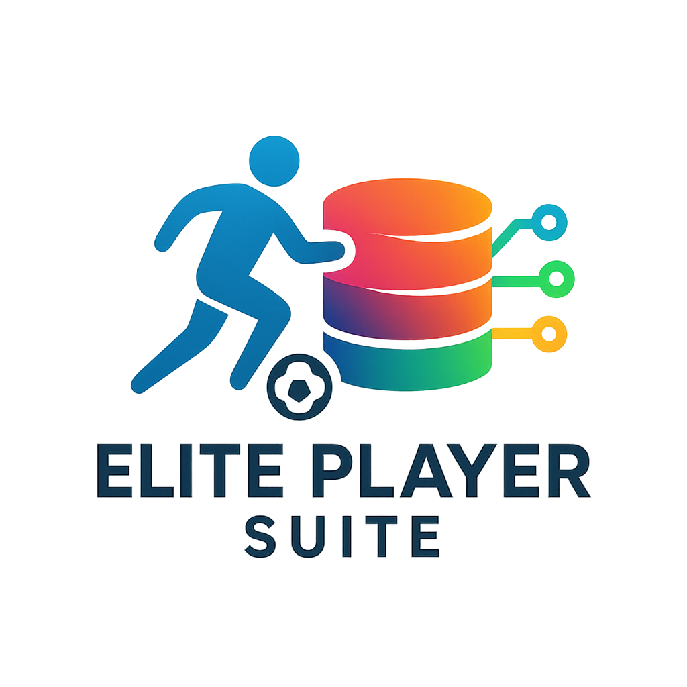

<div align="center">



# ⚽ Elite Player Suite: FIFA Player Database Management System

</div>

<div align="center">


*Elite Player Suite - A comprehensive desktop application for managing FIFA player profiles with an intuitive GUI and robust database operations*

</div>

## 🎯 Overview

**Elite Player Suite** is a sophisticated desktop application designed for football enthusiasts who want to manage and explore player databases with ease. Built with modern Python technologies, it provides a seamless experience for creating, searching, updating, and deleting player profiles from a comprehensive FIFA player database.

### ✨ Key Features

- 🔍 **Advanced Search & Filtering**: Multi-criteria search by name, overall rating, position, and nationality
- 📊 **Interactive Data Table**: Clean, organized display of player information with sorting capabilities
- 🎚️ **Dynamic Rating Slider**: Visual overall rating filter with real-time updates
- 🌍 **Nationality Filtering**: Comprehensive list of football nations for precise filtering
- 🎵 **Enhanced UX**: Background music and polished UI for engaging user experience
- 💾 **Robust Database**: SQLite-powered persistent storage with CRUD operations
- 🏗️ **Modular Architecture**: Clean separation of concerns with proper MVC pattern

## 🚀 Quick Start

### Prerequisites

```bash
# Ensure you have Python 3.x installed
python --version

# Install required dependencies
pip install PyQt6
```

### Installation & Running

1. **Clone the repository**
   ```bash
   git clone https://github.com/erfan-nourbakhsh/Elite-Player-Suite.git
   cd Elite-Player-Suite
   ```

2. **Launch the application**
   ```bash
   python FifaUI.py
   ```

3. **Initialize the database**
   - Click the **CREATE** button to populate the database with player data
   - Start exploring with the **SEARCH** functionality

## 🎮 How to Use

### Basic Operations

| Operation | Description | How To |
|-----------|-------------|---------|
| **Create** | Initialize player database | Click `CREATE` button (one-time setup) |
| **Search** | Find players by criteria | Set filters and click `SEARCH` |
| **Update** | Modify player information | Enter new data and click `UPDATE` |
| **Delete** | Remove specific players | Select criteria and click `DELETE` |
| **Close** | Clean exit with data cleanup | Click `CLOSE` button |

### Search Filters

- **Player Name**: Search by first name (supports partial matches)
- **Overall Rating**: Use the slider to set minimum rating (30-99)
- **Position**: Filter by player position (ST, CM, LW, etc.)
- **Nationality**: Select from 13 major football nations or "Any"

## 🏗️ Project Architecture

The application follows a clean **Model-View-Controller (MVC)** pattern:

```
📁 Project Structure
├── 🎮 FifaUI.py          # Main GUI application & Controller
├── 🧠 FifaBLL.py         # Business Logic Layer & Model
├── 🗄️ FifaDataAccess.py  # Data Access Layer
├── 📊 FifaDataModel.py   # Qt Table Model for data display
├── 💾 FIFA24.db          # SQLite database file
├── 🎵 music.mp3          # Background audio
└── 🖼️ icon.webp          # Application icon
```

### Component Details

- **UI Layer** (`FifaUI.py`): PyQt6-based graphical interface with responsive design
- **Business Logic** (`FifaBLL.py`): Player management operations and data validation
- **Data Access** (`FifaDataAccess.py`): SQLite database operations with error handling
- **Data Model** (`FifaDataModel.py`): Qt table model for efficient data display

## 🗃️ Database Schema

The application uses a single table structure optimized for player management:

```sql
Table: tblPlayers
├── id (INTEGER)        # Unique player identifier
├── firstName (TEXT)    # Player's first name
├── lastName (TEXT)     # Player's last name
├── nation (TEXT)       # Player's nationality
├── club (TEXT)         # Current club
├── position (TEXT)     # Playing position
└── overall (INTEGER)   # FIFA overall rating (30-99)
```

## 🌟 Sample Data

The application comes pre-loaded with **30 legendary players** including:

- **Superstars**: Messi, Ronaldo, Mbappé, Neymar
- **Legends**: Zidane, Pirlo, Buffon, Maldini
- **Rising Stars**: Haaland, Gavi, Vinicius Jr.
- **Local Heroes**: Iranian league standouts

## 🛠️ Technical Implementation

### Technologies Used

- **Frontend**: PyQt6 for modern, cross-platform GUI
- **Backend**: Pure Python with object-oriented design
- **Database**: SQLite for lightweight, serverless storage
- **Audio**: PyQt6 multimedia for background music
- **Architecture**: Clean separation with proper abstraction layers

### Key Technical Features

- **Parameterized Queries**: SQL injection protection
- **Connection Management**: Automatic resource cleanup
- **Error Handling**: Comprehensive exception management
- **Memory Efficiency**: Optimized data loading and display
- **Cross-Platform**: Native look and feel on Windows/macOS

## 🤝 Contributing

Contributions are welcome! Feel free to:

1. 🍴 Fork the repository
2. 🌿 Create a feature branch
3. 💻 Make your improvements
4. 📤 Submit a pull request

## 📄 License

This project is open source and available under the [MIT License](LICENSE).

---

<div align="center">

**⭐ If you found this project helpful, please give it a star! ⭐**

*Built with ❤️ for football fans everywhere*

</div>

